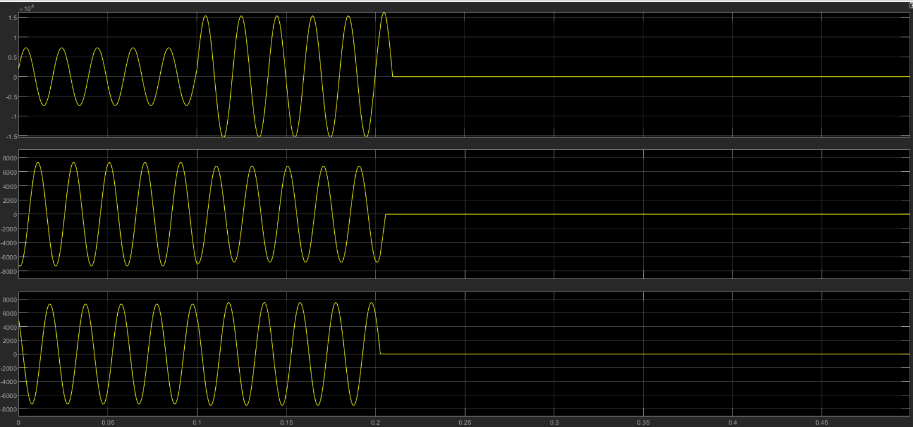
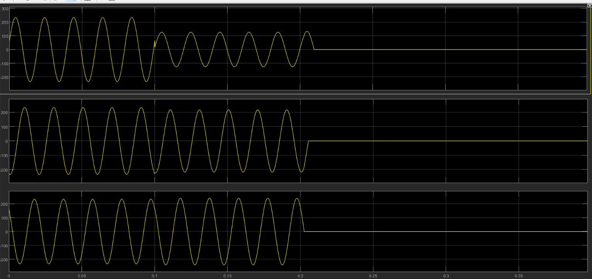
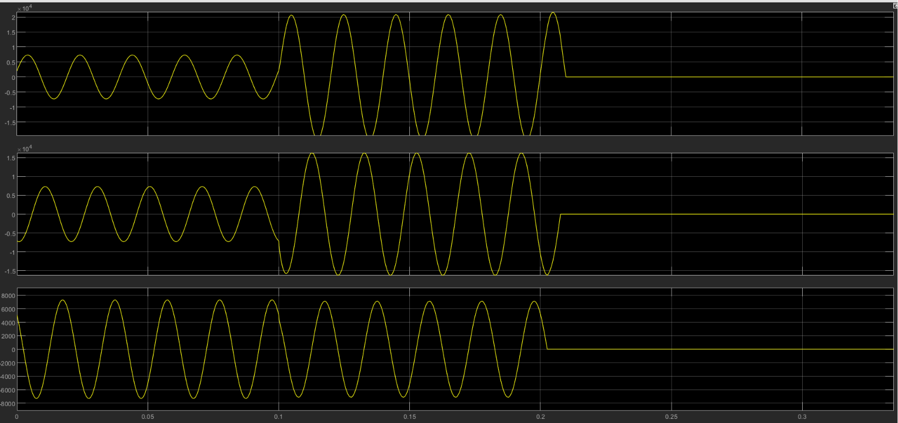
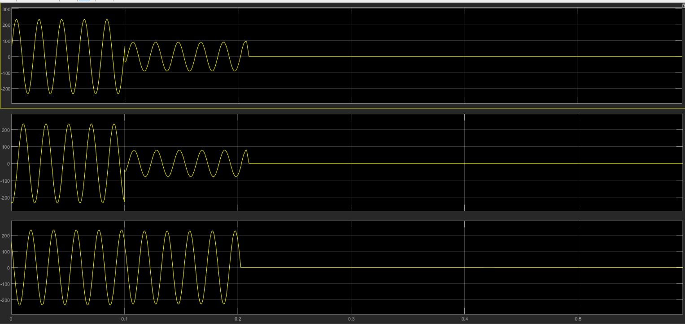
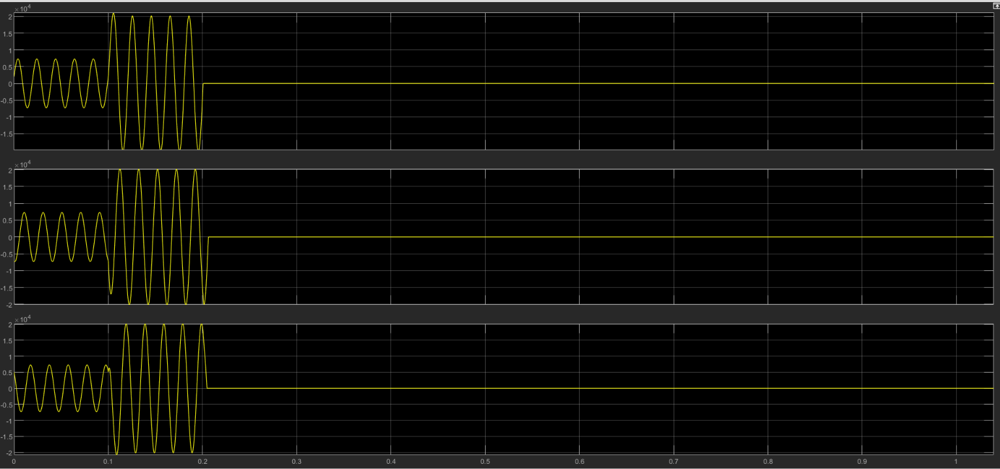
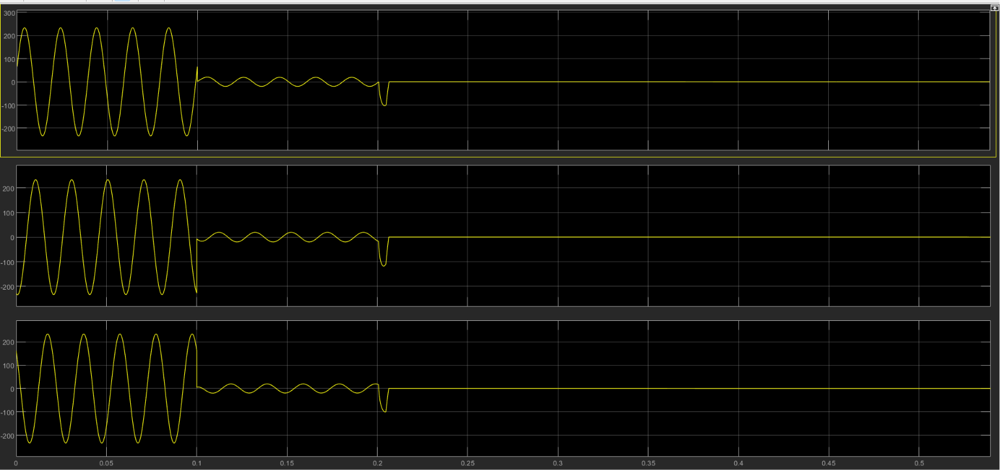
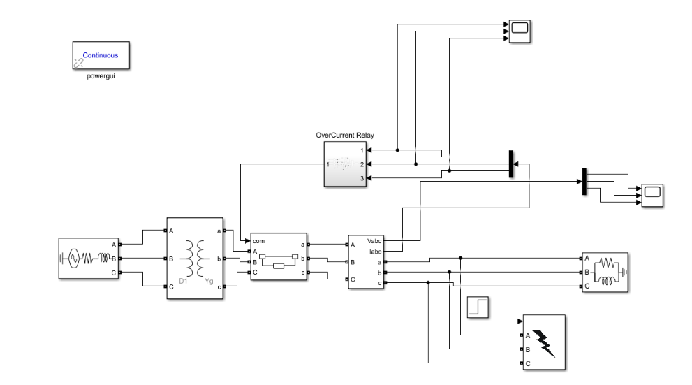
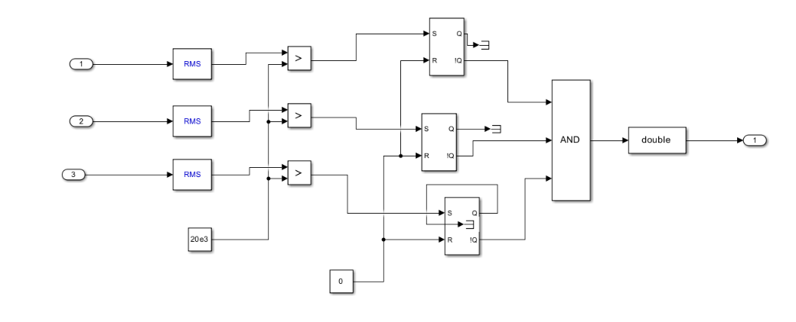

# Three-Phase Fault Detection and Protection using Overcurrent Relay

MATLAB/Simulink project for studying different faults in a three-phase power system and their detection using an overcurrent relay.

## 📌 Project Overview

The model consists of:

- Three-phase source
- Three-phase transformer
- Circuit breaker
- Three-phase load
- Fault block
- RMS current measurement
- Overcurrent relay

The relay monitors the phase currents and compares the RMS current with a predefined threshold. When an overcurrent condition is detected, a trip signal is generated.

## 🎯 Objective

- To model a three-phase power system in MATLAB/Simulink.
- To simulate different types of faults.
- To observe the effect of faults on voltage and current waveforms.
- To implement basic overcurrent-based fault detection.
- To study the operation of a protection system using a circuit breaker.

## Faults Simulated

### 1. Line-to-Ground (LG) Fault

A single phase is connected to ground, causing a disturbance in current and voltage.

---

### 2. Double Line-to-Ground (LLG) Fault

Two phases are connected to ground, resulting in changes in the phase currents and voltages.

---

### 3. Three-Phase (LLL) Fault

All three phases are involved in the fault, producing significant changes in the three-phase currents and voltages.

## Overcurrent Relay

The relay consists of:

- RMS current measurement
- Comparator
- SR flip-flop logic
- Trip output

### Basic Operation

**Measure Current → Calculate RMS → Compare with Threshold → Generate Trip Signal**

## Key Features

- Three-phase power system modelling
- LG, LLG and LLL fault simulation
- Phase current and voltage measurement
- RMS-based overcurrent detection
- Basic relay and trip logic
- Analysis of simulated fault waveforms

## Project Model

## Relay Subsystem

## Software Used

- MATLAB
- Simulink
- Simscape Electrical

## 📁 Repository Structure

    Three-Phase-Fault-Protection-Simulink/
    │
    ├── README.md
    │
    ├── Simulink/
    │   └── ThreePhaseFault.slx
    │
    ├── Results/
    │   ├── LG_Fault_Current.png
    │   ├── LG_Fault_Voltage.png
    │   ├── LLG_Fault_Current.png
    │   ├── LLG_Fault_Voltage.png
    │   ├── LLL_Fault_Current.png
    │   └── LLL_Fault_Voltage.png
    │
    ├── Relay/
    │   └── OverCurrentRelay.png
    │
    └── Model/
        └── ThreePhaseFault.png

## 👩‍💻 Author

**Mampi Das**  
B.Tech – Electrical Engineering  
National Institute of Technology Agartala

## ⚠️ Disclaimer

This project is a MATLAB/Simulink simulation developed for academic and learning purposes. The results are based on the parameters and assumptions used in the simulation and are not intended to represent an industrial protection system.

